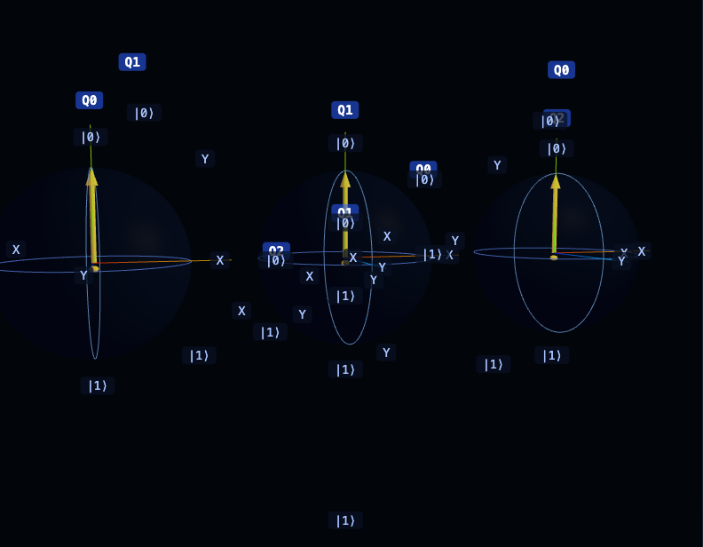

# Qubit 3D Simulator

큐빗(qubit)의 상태를 블로흐 구(Bloch Sphere)로 3D 시각화하는 양자컴퓨터 시뮬레이터입니다.  
1~3큐빗 시뮬레이션, CNOT 게이트, 얽힘(entanglement) 시각화를 지원합니다.



---

## 실행 방법

### 데스크탑 앱 (Electron)

```bash
npm install
npm start
```

배포용 DMG 빌드:

```bash
npm run dist:mac
```

`dist/` 폴더에 생성된 DMG를 열어 `/Applications`에 설치하면 됩니다.

### 웹 브라우저

`script.js`가 ES 모듈을 사용하므로 로컬 서버가 필요합니다.

```bash
python3 -m http.server 8080
# 브라우저에서 http://localhost:8080 접속
```

또는 동봉된 스크립트 사용:

```bash
bash run.sh
```

---

## 기능

| 기능 | 설명 |
|------|------|
| **1 / 2 / 3 큐빗** | 라디오 버튼으로 큐빗 수 선택 (기본 2큐빗) |
| **게이트** | X, Y, Z, H, S, T, RX, RY |
| **CNOT** | 2~3큐빗에서 제어·타겟 선택 후 적용 |
| **측정** | 확률적 파동함수 붕괴 시뮬레이션 |
| **프리셋** | 벨 상태, GHZ 상태 등 원클릭 예제 |
| **Custom Rotation** | 축과 각도를 직접 지정해 회전 |
| **State Vector 표** | 각 basis 상태의 복소수 진폭과 측정 확률 표시 |
| **블로흐 구 회전** | 각 큐빗이 자체 축을 기준으로 독립 회전 |

---

## 양자 현상 확인 방법

### 벨 상태 (2큐빗 얽힘)

1. 큐빗 수 **2** 선택
2. **벨 상태** 프리셋 클릭 → `H → CNOT` 자동 적용
3. 두 블로흐 구의 화살표가 모두 사라짐 = 얽힘 발생
4. **Measure** → 항상 `00` 또는 `11`만 출력

### GHZ 상태 (3큐빗 얽힘)

1. 큐빗 수 **3** 선택
2. **GHZ 상태** 프리셋 클릭
3. 세 화살표 모두 사라짐
4. **Measure** → 항상 `000` 또는 `111`만 출력

> 자세한 설명은 [GUIDE.md](GUIDE.md)를 참고하세요.

---

## 기술 스택

| 라이브러리 | 버전 | 역할 |
|---|---|---|
| [Electron](https://www.electronjs.org/) | 42 | 데스크탑 앱 패키징 |
| [Three.js](https://threejs.org/) | r152 | 3D 렌더링 (WebGL) |
| [math.js](https://mathjs.org/) | 15 | 복소수 행렬 연산 |

---

## 주요 변경 이력

- **2025-05-17** Electron 데스크탑 앱 지원 추가 (`npm start` / `npm run dist:mac`)
- **2025-05-17** 기본 큐빗 수 2개로 변경
- **2025-05-17** 각 블로흐 구 독립 자전 회전으로 변경 (중심 공전 → 자체 Y축 회전)
- **2025-05-17** CSS2DRenderer 레이블 잔상 문제 수정 → Three.js Sprite로 교체
- **2025-05-17** 2·3큐빗 CNOT + 얽힘 시각화, 프리셋(벨/GHZ) 추가
- **2025-05-17** 블로흐 구 렌더링 오류 수정 (THREE UMD/ESM 충돌 → importmap으로 해결)
